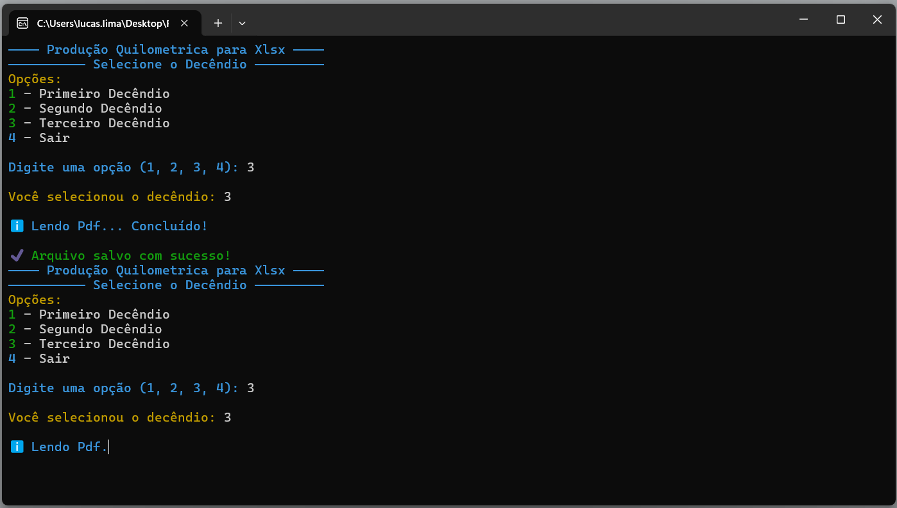
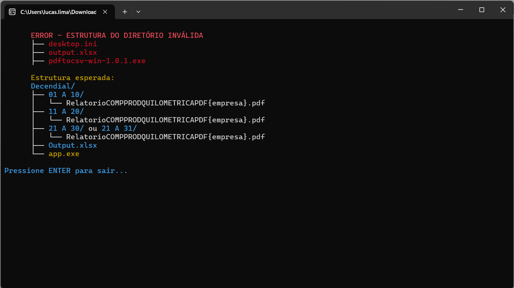

# PdfToXlsx - Produção Quilométrica para XLSX

**PdfToXlsx** é uma aplicação desktop com interface de terminal (clicável) que automatiza a extração e conversão de relatórios de produção quilométrica em PDF para planilhas `.xlsx`. Desenvolvido para atender um caso específico de negócio, o aplicativo valida a estrutura de diretórios, lê os arquivos PDF referentes aos decêndios e gera automaticamente uma planilha estruturada com os dados consolidados.

## 🎯 Objetivo

Facilitar o processo de leitura e extração de informações de relatórios de produção quilométrica, reduzindo o trabalho manual e o risco de erros humanos durante a geração de planilhas mensais.

## 📸 Capturas de Tela

### Interface principal

### Validação de estrutura de diretórios

## 📁 Estrutura Esperada dos Arquivos

O programa exige que os arquivos estejam organizados da seguinte maneira: 

Decendial/
├── 01 A 10/
│ └── RelatorioCOMPPRODQUILOMETRICAPDF{empresa}.pdf
├── 11 A 20/
│ └── RelatorioCOMPPRODQUILOMETRICAPDF{empresa}.pdf
├── 21 A 30/ ou 21 A 31/
│ └── RelatorioCOMPPRODQUILOMETRICAPDF{empresa}.pdf
├── Output.xlsx
└── app.exe

Caso a estrutura esteja incorreta, o programa exibirá uma mensagem de erro informando o formato esperado.

## ⚙️ Como Usar

1. **Faça o download do executável** (`pdftoXlsx-win-x.y.z.exe`);
2. **Coloque o executável na pasta raiz** onde a estrutura de diretórios está organizada conforme mostrado acima;
3. **Clique duas vezes no executável** para iniciar;
4. **Selecione o decêndio** (1, 2 ou 3) para processar;
5. O arquivo `Output.xlsx` será gerado ou atualizado com os dados extraídos.

> Não é necessário utilizar o terminal ou linha de comando — o app é executado com duplo clique.

## 🚧 Observação

Embora o uso seja específico para o contexto empresarial de relatórios decendiais, o projeto demonstra habilidades em:

- Parsing de PDFs;
- Validação de estrutura de diretórios;
- Geração de planilhas Excel via script;
- Criação de interface interativa no terminal;
- Empacotamento para distribuição em Windows.

## 📄 Licença

Este projeto está licenciado sob os termos do MIT. Veja o arquivo [LICENSE](./LICENSE) para mais detalhes.
